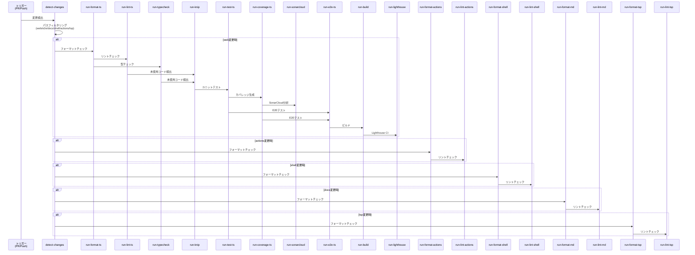
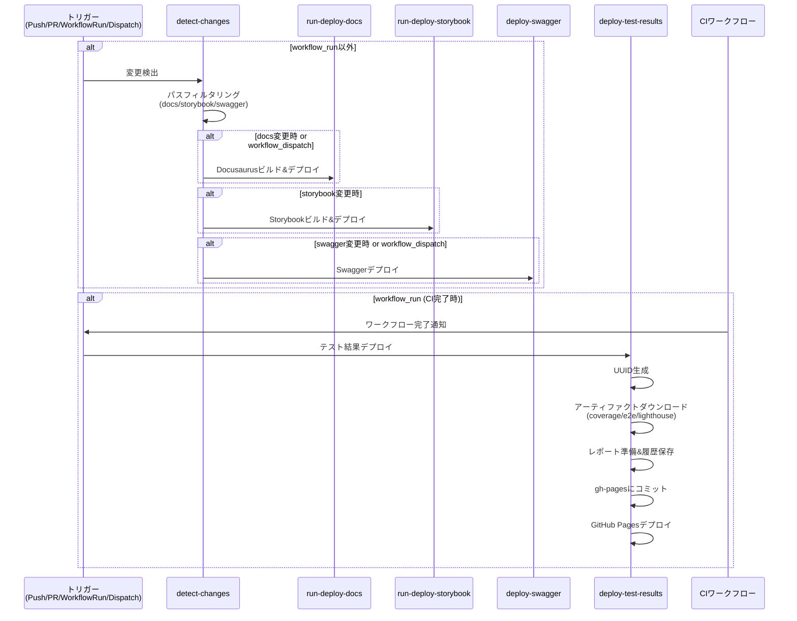
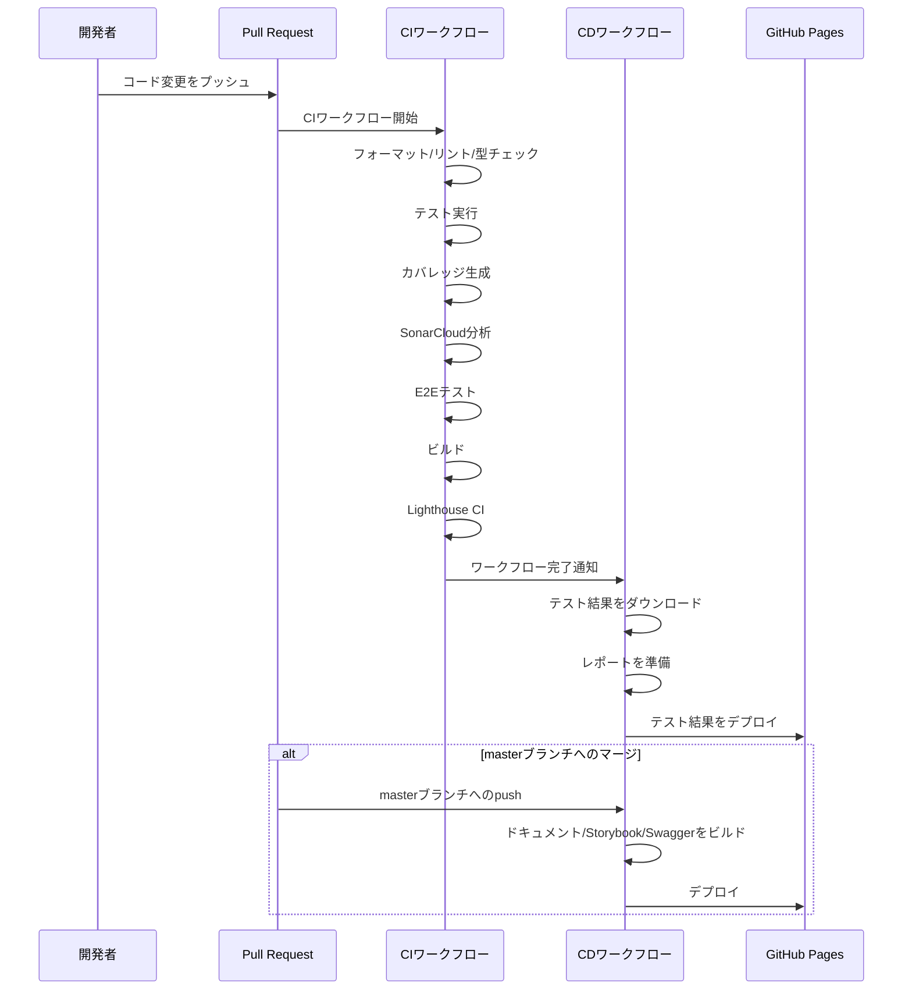

# CI/CDツール

このプロジェクトでは、コード品質と依存関係管理のために次のツールを使用しています。

## GitHub Actions ワークフロー

このプロジェクトでは、CI/CDパイプラインとして2つの主要なワークフローを使用しています。

- **CIワークフロー** (`.github/workflows/ci.yml`): コード品質チェックとテスト
- **CDワークフロー** (`.github/workflows/cd.yml`): デプロイメント

### CIワークフロー (`[CI] Validation and Checks`)

#### トリガー条件

- **pull\_request**: 次のパスが変更された場合
  - `.github/**`
  - `docs/**`
  - `scripts/**`
  - `app/**`
  - `apps/web/e2e/**`
  - `package.json`
- **push**: 上記と同じパスが変更された場合
- **除外条件**: `copilot/` で始まるブランチは除外

#### ジョブ一覧

1. **detect-changes**
   - 変更されたファイルを検出し、次のカテゴリに分類
   - 出力: `web` / `e2e` / `docs` / `shell` / `actions` / `tsp`
   - タイムアウト: 5分

2. **run-format-ts** (web変更時)
   - TypeScriptファイルのフォーマットチェック
   - コマンド: `bun run fmt:ts:check`
   - タイムアウト: 10分
   - 依存: `detect-changes`

3. **run-lint-ts** (web変更時)
   - TypeScriptファイルのリントチェック
   - コマンド: `bun run lint:ts:check`
   - タイムアウト: 10分
   - 依存: `detect-changes`, `run-format-ts`

4. **run-typecheck** (web変更時)
   - TypeScriptの型チェック
   - コマンド: `bun run typecheck`
   - タイムアウト: 10分
   - 依存: `detect-changes`, `run-format-ts`

5. **run-knip** (web変更時)
   - 未使用コードの検出
   - コマンド: `bun run knip`
   - タイムアウト: 10分
   - 依存: `detect-changes`, `run-lint-ts`, `run-typecheck`

6. **run-test-ts** (web変更時)
   - ユニットテストの実行
   - コマンド: `bun run test`
   - タイムアウト: 15分
   - 依存: `detect-changes`, `run-lint-ts`, `run-typecheck`, `run-knip`

7. **run-coverage-ts** (web変更時)
   - テストカバレッジの生成
   - コマンド: `bun run coverage`
   - アーティファクト: `vitest-coverage` (`docs/vitest/coverage/`)
   - 保持期間: 7日
   - タイムアウト: 15分
   - 依存: `detect-changes`, `run-test-ts`

8. **run-sonarcloud** (web変更時)
   - SonarCloudによるコード品質分析
   - カバレッジレポートを使用
   - 権限: `contents: read`, `pull-requests: write`, `security-events: write`
   - エラーハンドリング: `continue-on-error: true`
   - タイムアウト: 15分
   - 依存: `detect-changes`, `run-coverage-ts`

9. **run-e2e-ts** (webまたはe2e変更時)
   - E2Eテストの実行（Playwright）
   - Docker Buildxを使用
   - コマンド: `bun run e2e`
   - アーティファクト: `playwright-report` (`docs/playwright/report/`)
   - 保持期間: 7日
   - タイムアウト: 30分
   - 依存: `detect-changes`, `run-test-ts`, `run-coverage-ts`

10. **run-build** (web変更時)
    - アプリケーションのビルド
    - コマンド: `bun run build:remix`
    - タイムアウト: 15分
    - 依存: `detect-changes`, `run-e2e-ts`

11. **run-lighthouse** (web変更時)
    - Lighthouse CIによるパフォーマンス分析
    - コマンド: `bun run lighthouse`
    - アーティファクト: `lighthouse-report` (`docs/lighthouse/report/`)
    - 保持期間: 7日
    - タイムアウト: 20分
    - 依存: `detect-changes`, `run-build`

12. **run-format-actions** (actions変更時)
    - GitHub Actionsワークフローのフォーマットチェック
    - コマンド: `npm run fmt:actions:check`
    - タイムアウト: 5分
    - 依存: `detect-changes`

13. **run-lint-actions** (actions変更時)
    - GitHub Actionsワークフローのリントチェック
    - コマンド: `npm run lint:actions:check`
    - タイムアウト: 10分
    - 依存: `detect-changes`, `run-format-actions`

14. **run-format-shell** (shell変更時)
    - Shellスクリプトのフォーマットチェック
    - コマンド: `npm run fmt:shell:check`
    - タイムアウト: 5分
    - 依存: `detect-changes`

15. **run-lint-shell** (shell変更時)
    - Shellスクリプトのリントチェック
    - コマンド: `npm run lint:shell:check`
    - タイムアウト: 10分
    - 依存: `detect-changes`, `run-format-shell`

16. **run-format-md** (docs変更時)
    - Markdownファイルのフォーマットチェック
    - コマンド: `npm run fmt:md:check`
    - タイムアウト: 5分
    - 依存: `detect-changes`

17. **run-lint-md** (docs変更時)
    - Markdownファイルのリントチェック
    - コマンド: `npm run lint:md:check`
    - タイムアウト: 10分
    - 依存: `detect-changes`, `run-format-md`

18. **run-format-tsp** (tsp変更時)
    - TypeSpecファイルのフォーマットチェック
    - コマンド: `bun run fmt:tsp:check`
    - タイムアウト: 10分
    - 依存: `detect-changes`

19. **run-lint-tsp** (tsp変更時)
    - TypeSpecファイルのリントチェック
    - コマンド: `bun run lint:tsp:check`
    - タイムアウト: 10分
    - 依存: `detect-changes`, `run-format-tsp`

### CDワークフロー (`[CD] Deploy`)

#### CDワークフローのトリガー条件

- **push** (masterブランチ): 次のパスが変更された場合
  - `docs/**`
  - `app/**`
  - `.storybook/**`
  - `vite.config.ts`
  - `docs/swagger/**`
  - `.github/workflows/deploy.yml`
- **pull\_request** (masterブランチ): 次のパスが変更された場合
  - `docs/**`
  - `.github/workflows/deploy.yml`
- **workflow\_run**: CIワークフロー完了時
- **workflow\_dispatch**: 手動実行

#### CDワークフローのジョブ一覧

1. **detect-changes** (workflow\_run以外)
   - 変更されたファイルを検出し、次のカテゴリに分類
   - 出力: `docs`, `storybook`, `swagger`
   - タイムアウト: 5分

2. **run-deploy-docs**
   - Docusaurusドキュメントのビルドとデプロイ
   - 環境: `github-pages`
   - ステップ:
     - Docusaurusのビルド (`bun run build`)
     - GitHub Pagesへのデプロイ
   - タイムアウト: 15分
   - 依存: `detect-changes`
   - 実行条件:
     - `workflow_run`以外で`docs`変更時、または`workflow_dispatch`時

3. **run-deploy-storybook**
   - Storybookのビルドとデプロイ
   - 環境: `github-pages-storybook`
   - ステップ:
     - Storybookのビルド (`bun run build:ui`)
     - GitHub Pagesへのデプロイ
   - タイムアウト: 15分
   - 依存: `detect-changes`
   - 実行条件: `workflow_run`以外で`storybook`変更時

4. **deploy-swagger**
   - Swaggerドキュメントのデプロイ
   - 環境: `github-pages-swagger`
   - ステップ:
     - Swaggerファイルのアップロード
     - GitHub Pagesへのデプロイ
   - タイムアウト: 5分
   - 依存: `detect-changes`
   - 実行条件:
     - `workflow_run`以外で`swagger`変更時、または`workflow_dispatch`時

5. **deploy-test-results**
   - CIワークフローのテスト結果をGitHub Pagesにデプロイ
   - 環境: `github-pages-test-results`
   - 実行条件:
     - `workflow_run`イベント時
     - CIワークフローが成功時
     - `copilot/`で始まらないブランチ
   - ステップ:
     - UUID生成 (`run_id-run_number`)
     - CIワークフローからアーティファクトをダウンロード
       - `vitest-coverage` (カバレッジレポート)
       - `playwright-report` (E2Eテストレポート)
       - `lighthouse-report` (Lighthouseレポート)
     - レポートの準備と履歴保存
     - `gh-pages`ブランチにコミット
     - GitHub Pagesへのデプロイ
   - タイムアウト: 30分
   - 権限: `contents: write`, `pages: write`, `id-token: write`

#### 同時実行制御

- **concurrency**: `pages-deploy`
- **cancel-in-progress**: `false` (進行中のジョブをキャンセルしない)

### CIワークフロー シーケンス図



### CDワークフロー シーケンス図



### CI/CD統合フロー



## Renovate

Renovateは依存関係の自動更新を管理するツールです。

### 設定

設定ファイルは `.github/renovate.json` にあります。

### 主な機能

- **自動依存関係検出**: `package.json` の依存関係を自動的に検出
- **スケジュール実行**: 毎週月曜日の午前10時（JST）にPRを作成
- **グループ化**: 関連するパッケージをまとめて更新
  - Remix関連パッケージ
  - Radix UIパッケージ
  - Docusaurusパッケージ
  - TypeScript関連パッケージ
  - 開発依存関係
- **自動マージ**: マイナー・パッチバージョンの更新は自動マージ可能
- **セキュリティ更新**: 脆弱性が検出された場合は即座にPRを作成

### 使用方法

1. **Renovate Appのインストール**:
   - GitHub MarketplaceからRenovate Appをリポジトリにインストール
   - 初回実行時に設定ファイルを自動検出

2. **PRの確認**:
   - Renovateが作成したPRをレビュー
   - マイナー・パッチバージョンは自動マージ可能
   - メジャーバージョンは手動レビューが必要

3. **設定のカスタマイズ**:
   - `.github/renovate.json` を編集して設定を変更
   - 変更後、次回のスケジュール実行時に反映

### 設定例

```json
{
  "schedule": ["before 10am on monday"],
  "timezone": "Asia/Tokyo",
  "packageRules": [
    {
      "matchUpdateTypes": ["minor", "patch"],
      "automerge": true
    }
  ]
}
```

## SonarCloud

SonarCloudはコード品質・セキュリティ分析をするクラウドサービスです。

### SonarCloudの設定

設定ファイルは `sonar-project.properties` にあります。

### SonarCloudの主な機能

- **コード品質分析**: TypeScript/JavaScriptコードの品質を分析
- **セキュリティ脆弱性検出**: 既知の脆弱性パターンを検出
- **コードカバレッジ統合**: テストカバレッジレポートを統合
- **PRコメント**: プルリクエストに品質ゲート結果をコメント

### 初期設定

1. **SonarCloudでプロジェクト作成**:
   - [SonarCloud](https://sonarcloud.io/) にアクセス
   - GitHubアカウントでログイン
   - 組織を作成（初回のみ）
   - プロジェクトをインポート

2. **トークンの生成**:
   - SonarCloudの「My Account」→「Security」からトークンを生成
   - GitHubリポジトリの「Settings」→「Secrets and variables」→「Actions」に追加
   - シークレット名: `SONAR_TOKEN`

3. **プロジェクトキーの確認**:
   - SonarCloudのプロジェクトページでプロジェクトキーを確認
   - `sonar-project.properties` の `sonar.projectKey` と `sonar.organization` を更新

### CI統合

CIワークフロー（`.github/workflows/ci.yml`）に `run-sonarcloud` ジョブが含まれています。

- **実行タイミング**: カバレッジレポート生成後
- **権限**: `security-events: write` が必要
- **エラーハンドリング**: `continue-on-error: true` により、失敗しても他のジョブに影響しない

### カバレッジレポート

SonarCloudは次のカバレッジレポートを使用します：

- **パス**: `docs/vitest/coverage/lcov.info`
- **形式**: LCOV形式
- **生成**: `bun run coverage` コマンドで生成

### 品質ゲート

SonarCloudの品質ゲートは次の条件で評価されます：

- コードカバレッジ
- コードスメル（コードの臭い）
- セキュリティ脆弱性
- バグ

品質ゲートが失敗した場合、PRにコメントが追加されます。

### 除外設定

次のパスは分析から除外されています：

- `node_modules/`
- `build/`, `dist/`
- `docs/`
- テストファイル（`*.test.ts`, `*.spec.ts` など）
- 設定ファイル（`*.config.ts`, `*.json` など）

詳細は `sonar-project.properties` の `sonar.exclusions` を参照してください。

## トラブルシューティング

### RenovateがPRを作成しない

- Renovate Appがリポジトリにインストールされているか確認
- `.github/renovate.json` がまさしく配置されているか確認
- Renovate Appのログを確認

### SonarCloudが実行されない

- `SONAR_TOKEN` シークレットが設定されているか確認
- `sonar-project.properties` のプロジェクトキーが正しいか確認
- CIワークフローのログを確認

### カバレッジレポートが見つからない

- `bun run coverage` が正常に実行されているか確認
- `docs/vitest/coverage/lcov.info` が生成されているか確認
- カバレッジレポートのパスが正しいか確認
