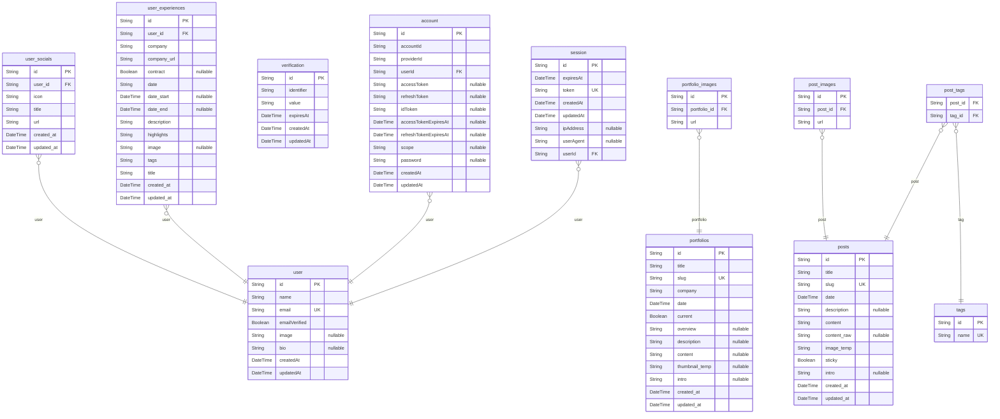

# データベース設計書

> Generated by [`prisma-markdown`](https://github.com/samchon/prisma-markdown)

- [default](#default)

## default

### `user`

Properties as follows:

- `id`:
- `name`:
- `email`:
- `emailVerified`:
- `image`:
- `bio`:
- `createdAt`:
- `updatedAt`:

### `session`

Properties as follows:

- `id`:
- `expiresAt`:
- `token`:
- `createdAt`:
- `updatedAt`:
- `ipAddress`:
- `userAgent`:
- `userId`:

### `account`

Properties as follows:

- `id`:
- `accountId`:
- `providerId`:
- `userId`:
- `accessToken`:
- `refreshToken`:
- `idToken`:
- `accessTokenExpiresAt`:
- `refreshTokenExpiresAt`:
- `scope`:
- `password`:
- `createdAt`:
- `updatedAt`:

### `verification`

Properties as follows:

- `id`:
- `identifier`:
- `value`:
- `expiresAt`:
- `createdAt`:
- `updatedAt`:

### `portfolios`

Properties as follows:

- `id`:
- `title`:
- `slug`:
- `company`:
- `date`:
- `current`:
- `overview`:
- `description`:
- `content`:
- `thumbnail_temp`:
- `intro`:
- `created_at`:
- `updated_at`:

### `portfolio_images`

Properties as follows:

- `id`:
- `portfolio_id`:
- `url`:

### `posts`

Properties as follows:

- `id`:
- `title`:
- `slug`:
- `date`:
- `description`:
- `content`:
- `content_raw`:
- `image_temp`:
- `sticky`:
- `intro`:
- `created_at`:
- `updated_at`:

### `tags`

Properties as follows:

- `id`:
- `name`:

### `post_tags`

Properties as follows:

- `post_id`:
- `tag_id`:

### `post_images`

Properties as follows:

- `id`:
- `post_id`:
- `url`:

### `user_experiences`

Properties as follows:

- `id`:
- `user_id`:
- `company`:
- `company_url`:
- `contract`:
- `date`:
- `date_start`:
- `date_end`:
- `description`:
- `highlights`:
- `image`:
- `tags`:
- `title`:
- `created_at`:
- `updated_at`:

### `user_socials`

Properties as follows:

- `id`:
- `user_id`:
- `icon`:
- `title`:
- `url`:
- `created_at`:
- `updated_at`:
